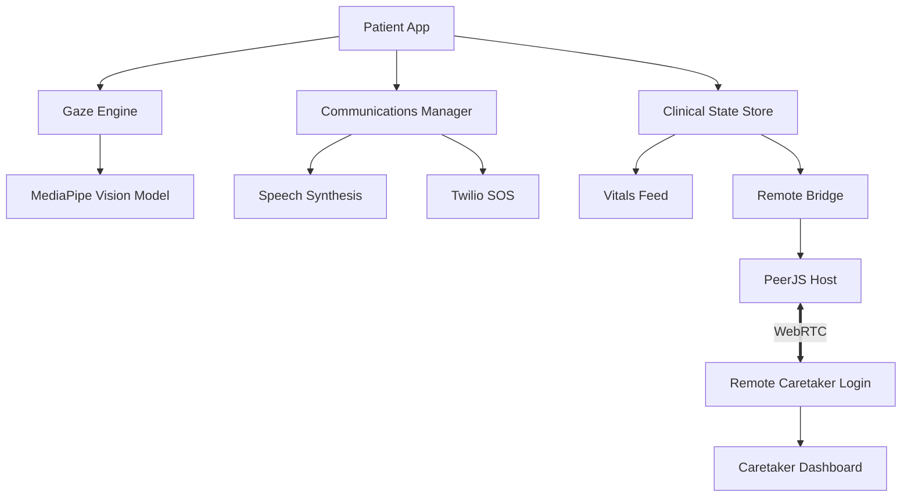

 


# Nayana (नयन)
### AI-Powered Clinical Vision & Communication Platform


**Empowering clinical communication through gaze intelligence.**


## 👁️ Overview

=======
# Nayana (नयन)
### AI-Powered Clinical Vision & Communication Platform
## 👁️ Overview

**Empowering clinical communication through gaze intelligence.**


**Nayana** (meaning "Eye" or "Vision") is a high-fidelity clinical platform designed for patients with limited mobility or speech impairments. By leveraging state-of-the-art **Gaze Tracking AI**, Nayana transforms eye movements into meaningful communication and provides clinicians with a real-time telemetry dashboard for remote monitoring.

### The Problem
Traditional assistive technologies are often prohibitively expensive or require invasive hardware. Patients in ICUs or with neurodegenerative conditions need a seamless, software-first solution to communicate their needs and for caregivers to monitor their vitals remotely.

### The Solution
A zero-hardware-requirement (webcam-only) gaze tracking interface that integrates:
1. **Real-time Gaze Interaction**: UI control via eye focus.
2. **Clinical Dashboard**: Real-time vitals and risk assessment.
3. **Remote Bridge**: Low-latency caretaker monitoring via WebRTC.

---

## ✨ Key Features

### 🎯 Gaze Engineering
- **MediaPipe Integration**: Sub-millimeter precision gaze estimation using neural vision models.
- **Adaptive Reticle**: Smoothed cursor movement with Dead-zone filtering to eliminate jitters.
- **Self-Calibration**: Intelligent calibration sequence to map user-specific facial geometry to screen space.

### 📋 Clinical Intelligence
- **Vitals Sidebar**: Real-time monitoring of HR, SpO2, and respiratory metrics.
- **Risk Assessment**: AI-driven panel identifying clinical risks like dehydration or distress signals.
- **Session Telemetry**: Gaze heatmaps and interaction logs for clinical review.

### 💬 Adaptive Communication
- **Phrase Chips**: Gaze-triggerable common phrases (e.g., "I am thirsty", "In pain").
- **Neural Speech**: High-quality text-to-speech engine for patient verbalization.
- **SOS Protocol**: Immediate alert system with Twilio integration for emergency SMS/calls.

### 🔗 Remote Caretaker Bridge
- **P2P Syncing**: Direct PeerJS connection for remote viewing of patient dashboard.
- **Secure Auth**: 6-digit session codes for verified caretaker access.
- **Real-time Feed**: Instant updates from the patient unit to the caretaker dashboard.

---

## 🛠️ Tech Stack

| Layer | Technology |
| :--- | :--- |
| **Core** | React 18, Vite |
| **Styling** | Tailwind CSS, Lucide Icons |
| **Gaze AI** | Google MediaPipe Vision (@mediapipe/tasks-vision) |
| **Real-Time** | PeerJS (WebRTC), Twilio API |
| **Analytics** | Custom Telemetry Hooks, html2pdf.js |
| **Deployment** | Vercel |

---

## 🏗️ System Architecture



---

## 🚀 Getting Started

### Prerequisites
- **Node.js**: v18.0.0+
- **NPM** or **Yarn**
- A functional webcam

### Installation

1. **Clone the repository**
   ```bash
   git clone https://github.com/sharonjoseph12/Nayana_codex.git
   cd Nayana_codex
   ```

2. **Install dependencies**
   ```bash
   npm install
   ```

3. **Configure Environment Variables**
   Create a `.env` file in the root:
   ```env
   VITE_PEER_SERVER=your_peerjs_server (optional)
   VITE_TWILIO_API_KEY=your_key
   ```

4. **Start Development Server**
   ```bash
   npm run dev
   ```

### Deployment
Easily deploy to Vercel:
```bash
vercel deploy
```

---

## 📄 License
This project is licensed under the MIT License - see the [LICENSE](LICENSE) file for details. (Default - update as per your project)

